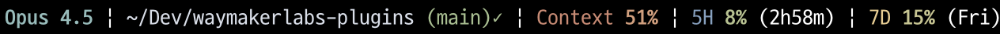

# Minimal Statusline

Minimal single-line statusline with Nord Aurora theme.

## Preview



## Color Scheme (Nord Aurora)

| Element | Color | Hex |
|---------|-------|-----|
| Model | Frost Teal | #8FBCBB |
| Directory | Snow Storm | #D8DEE9 |
| Git Branch | Aurora Green | #A3BE8C |
| Git Dirty | Aurora Yellow | #EBCB8B |
| Context | Aurora Orange | #D08770 |
| 5H | Frost Blue | #81A1C1 |
| 7D | Aurora Yellow | #EBCB8B |

### Usage Gradient

Percentage color changes based on usage:

```
0%  ───── 30% ───── 60% ───── 85% ───── 100%
Green    Yellow    Orange     Red
#A3BE8C  #EBCB8B   #D08770   #BF616A
```

## Features

- **Single Line**: All info displayed in one line
- **No Progress Bars**: Clean percentage numbers only
- **Nord Aurora Theme**: Unified Nord color palette
- **Smart Gradient**: Green → Yellow → Orange → Red based on usage

## Layout

```
Model | Directory (branch)status | Context % | 5H % (time) | 7D % (day)
```

## Installation

**1. Install plugin**
```bash
/plugin install minimal-statusline@waymakerlabs-claude-plugins
```

**2. Setup statusline**
```bash
/minimal-statusline-start
```

**3. Restart Claude Code**

> 💡 If statusline is not configured after installation, a setup prompt will appear on session start.

## Credits

Based on [Awesome Statusline](https://github.com/awesomejun/awesome-claude-plugins) by awesomejun.
